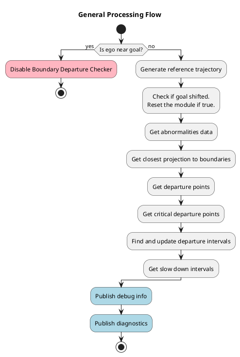
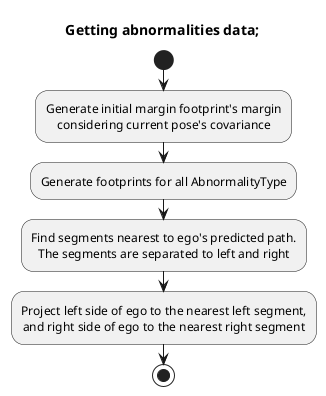

# Boundary Departure Prevention Module

!!! Warning

    The Boundary Departure Prevention Module is experimental. It subscribes to the control module’s predicted path and steering report, creating a circular dependency. This violates Autoware’s design principle of forward-only data flow, where control depends on planning, not the other way round. As a result, this module is not officially supported and will remain unofficial for the foreseeable future.

## Role

This module inserts slow down points and publishes error diagnostics when the ego vehicle is near or about to cross an uncrossable boundary, such as a road borders.

It also accounts for several types of erroneous behavior that could cause the vehicle to unintentionally cross these boundaries. These behaviors are classified as abnormalities.

## Abnormalities

Abnormalities refer to erroneous behaviors at the component level, often caused by noisy or unreliable outputs. In this module, these abnormalities are embedded into the predicted footprints derived from the control module's predicted path, specifically, the MPC (Model Predictive Control) trajectory. Each point along the MPC path is converted into a footprint, and potential deviations due to abnormal conditions are evaluated.

The module addresses the following types of abnormalities:

### 1. Normal (No Abnormality)

In typical operation, the MPC trajectory may contain small deviations or noise, especially when the vehicle cannot track the planned path perfectly. These deviations are minor and not necessarily the result of a malfunction, but they are still accounted for to ensure safe boundary handling.

### Localization Abnormality

Localization errors can cause the ego vehicle to misjudge its position relative to road boundaries such as curbs or road edges. This can happen due to:

- **Sensor noise or drift**, leading to inaccurate pose estimation.
- **Map inaccuracies**, where the HD map’s geometry does not precisely align with the real-world boundary.
- **Dynamic uncertainty** at higher speeds, where even small errors are magnified due to the vehicle covering more distance in less time, reducing the margin for correction.

These factors can result in the vehicle unintentionally approaching or crossing an uncrossable boundary, even when the planned path appears valid.

#### How Footprint Expansion Helps with Localization and Map Errors

- **Absorbs minor localization errors**: If the ego vehicle’s estimated position is slightly off due to GPS drift or sensor noise, an expanded footprint prevents false detections by tolerating small position shifts. This reduces the chance of incorrectly flagging a boundary crossing.
- **Compensates for map inaccuracies**: Slight misalignments in Lanelet2 map geometries, such as curb or road edge misplacement, can lead to false positives. An enlarged footprint creates a buffer that allows for safe operation even when the map boundary is not perfectly aligned with the real-world one.

By expanding the footprint, the system introduces a safety margin that accounts for minor localization and mapping uncertainties, especially critical at higher speeds.he expanded footprint creates a small buffer or "safety margin," allowing the vehicle to operate safely despite minor abnormality.

### Steering Abnormality

Unexpected steering behavior can cause the vehicle to deviate from its planned trajectory, leading to boundary departure even when planning and localization are functioning correctly. This can occur due to:

- **Actuator faults**: such as delayed or stuck steering commands.
- **Software issues**: like frozen control outputs or bugs in the steering optimization logic.
- **Unexpected maneuvers**: for example, emergency avoidance or unintended sharp turns.

In such cases, the actual motion of the vehicle diverges from the MPC trajectory, increasing the risk of departure.

    <table>
        <tr>
            <td></td>
        </tr>
        <tr>
            <td></td>
        </tr>
    </table>

#### How steering margin helps with steering abnormality

- **Catches lateral deviations early**: If the vehicle drifts due to steering faults, like stuck actuators or sudden command spikes, the expanded margin ahead of the vehicle can detect the deviation before the ego crosses into an unsafe region.
- **Predicts future risk along the path**: The margin extends along the forward direction of the predicted path, enabling the system to foresee potential boundary violations caused by small steering errors that compound over time.

This method works even when control outputs are inaccurate. Because the margin is computed using the predicted path, not just the current pose, it accounts for latency, actuator delays, and other uncertainties in vehicle response. This allows the system to trigger early mitigation actions, such as slowing down or stopping, before the situation becomes critical.

### Longitudinal Tracking Abnormality

Sometimes, the actual motion of the vehicle along the longitudinal axis does not match the MPC-predicted trajectory. For instance:

The ego vehicle might be ahead or behind the predicted position due to mismatches in acceleration or braking behavior.

This discrepancy becomes more problematic when the vehicle is near an uncrossable boundary, as it reduces the reliability of future footprint predictions.

#### How Longitudinal Expansion Helps with Tracking Abnormality

- **Accounts for ego being ahead of the predicted pose**: During lane changes, avoidance maneuvers, or turns on curved roads, the ego vehicle may move faster than expected or take a slightly different path than predicted. By extending the footprint longitudinally (in the direction of motion), the system accounts for the ego vehicle possibly being ahead of the current MPC trajectory point.
- **Uses speed-scaled margins**: The longitudinal margin is scaled based on the current vehicle speed, with an added buffer. At higher speeds, a larger margin is used to reflect the increased risk and reduced reaction time.
- **Captures mismatches during dynamic maneuvers**: In situations where heading is changing quickly, like on curved roads or during lateral motion, the ego’s actual position may significantly deviate from the MPC path. The extended footprint covers this discrepancy and helps detect boundary risks even if the predicted path appears safe.

This approach helps bridge the gap between prediction and reality. By expanding the footprint in the heading direction, the system ensures safe operation even when there are longitudinal tracking mismatches due to control delay, road surface changes, or other dynamic factors.

## Processing Flow

The following diagram shows the high-level processing flow of the Boundary Departure Prevention Module. It outlines the steps from checking proximity to the goal, through trajectory and abnormality analysis, to the publication of debug and diagnostic data.

### Generating abnormalities data

The diagram below illustrates how the module processes predicted trajectory points to generate footprints with embedded abnormality margins and find their projections relative to nearby map boundaries.

### Find and update departure intervals

!!! Warning

    TBA

### Get slow down intervals

!!! Warning

    TBA
